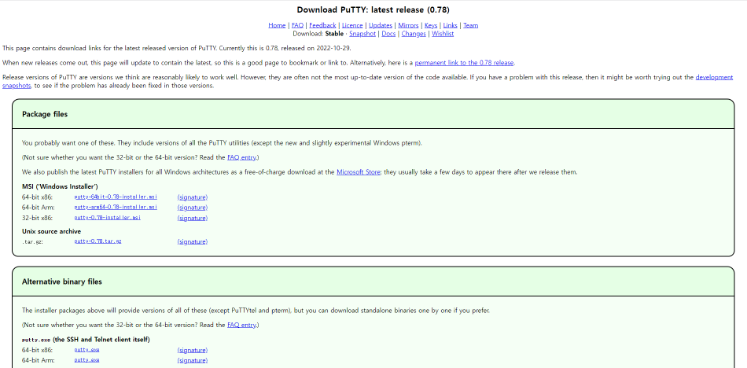

# **Putty를 이용한 Local OS와 Guest OS 연동 및 파일 공유하기**

> **<나의 환경><br>**
> Local OS: Window10 pro  
> Guest OS: CentOS 8  
> 응용 프로그램: Putty

<br>

## 1. putty 설치하기



<br>

## 2. Local OS(=Window)에서 cmd창 열기

<br>

## 3. PSCP 설치 유무 확인하기

putty를 설치 시 pscp파일도 자동 설치됨.

```
pscp/?
```

<br>

## 4. Local OS -> Guest OS 파일 전송

```
//디렉토리 경로 설정시 맨 앞 띄어쓰기 주의할 것!
pscp -r [전송할 파일 위치]* [리눅스계정]@[리눅스 IP]:[전송 받을 디렉토리 경로]

예시) pscp -r c:/sample/* root@192.168.0.1:/sample
```

<br>

## 5. Guest OS -> Local OS 파일 전송

```
//디렉토리 경로 설정시 맨 앞 띄어쓰기 주의할 것!
pscp -r [전송할 파일 위치]* [리눅스계정]@[리눅스 IP]:[전송 받을 디렉토리 경로]

예시) pscp -r c:/sample/* root@192.168.0.1:/sample
```
