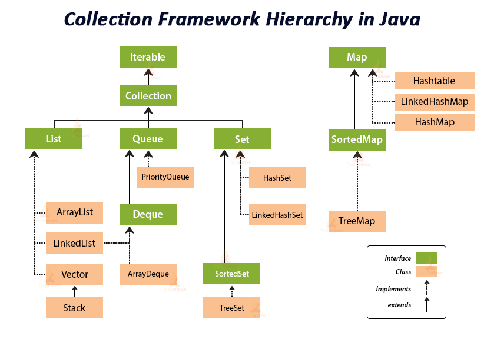

# **[JAVA] Collection 정리**

> **>>Array와 Collection의 차이**
>   
> Array(배열): 정적메모리, ex) new int[4]로 미리 선언을 해줘야 하며 4개의 공간 밖에 못 쓴다.  
> Collection: 동적메모리, 공간이 필요한 순간마다 바로 생성 및 추가 가능 
## **1. 자바의 컬렉션 종류**
- **List**

- **Set**
- **Queue**
- **Map**

--- 
 

## **# List**
- 중복되는 데이터를 담아 저장해야 할 때

- 배열에 들어가는 정해진 순서를 유지해야 할 때

- 순서가 있는 목록 = List

- 중복 O, 순서 O

    자바의 Collection들 중 List만 배열(Array)처럼 순서가 있다는 것이다.
    List